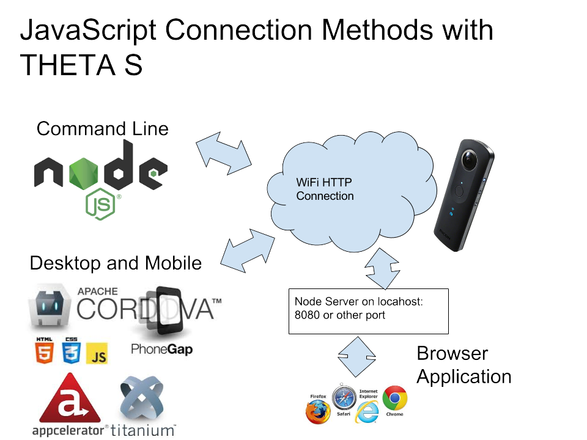

# Developing Apps for the RICOH THETA S with JavaScript
This is not for public use. I am testing the node
[request](https://github.com/request/request) module with the RICOH
THETA S. So far, it seems to work. I can start a session, take a picture,
get the status of the camera. The code is here only to share with my
friend for testing.

There are two JavaScript libraries that work with the RICOH THETA. I suggest
you read the information here:

- [THETA 360 Developers Unofficial API Guide](http://codetricity.github.io/theta-s/index.html#_javascript)

If the link is broken, [this](http://theta360.guide/blog/javascript/2015/12/17/theta-s-nodejs.html)
blog post should still work.

A JavaScript program running in the browser will not be able to
connect to the THETA directly due to security settings. To connect to
the THETA, you will need to use [node](https://nodejs.org/en/).

These methods work:

- node from the command line will connect to the camera
- node with Cordova and Titanium are reported to work for mobile and desktop apps.
I have not tested it.
- JavaScript browsers application talking to node server application will work.
Run the node server on your localhost and connect the localhost to the THETA
with WiFi. The browser is also running on the localhost, so you don't need Internet
access.

If you are connecting to the THETA with WiFi and want to use
a small computer (like a Raspberry Pi) that connects to the THETA and
another computer on the Internet, you can use two network interfaces.
For example, I have two cheap WiFi USB adapters on my Raspberry Pi and
power the RPi with a battery. My desktop Windows system has both Ethernet
and WiFi.

